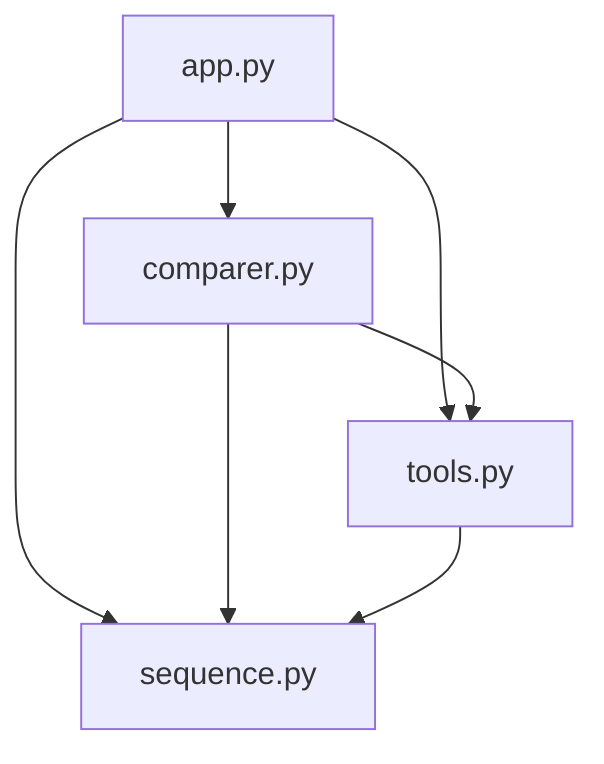

is## Table of Contents
- [CRC Cards](#crc-cards-class-responsibility-collaborators)
- [Description](#description)
- [UML diamran](#uml-diagram)
- [Method Documentation](#method-documentation)
  - [Sequence](#sequence-class-abstract)
  - [MitochondrialDNA](#mitochondrialdna-class)
  - [MotifFinder](#motiffinder-class)
  - [SequenceAlignWrapper](#sequencealignwrapper-class)
  - [AlignmentVisualizer](#alignmentvisualizer-class)
  - [SequenceComparer](#sequencecomparer-class)
  - [Parser](#parser-class)
  - [Tool](#tool-class-abstract)
  - [SequenceAligner](#sequencealigner-class)
  - [FastaManager](#fastamanager-class)
- [Web Interface Templates](#web-interface-templates)
- [Object-Oriented Design Principles](#object-oriented-design-principles)
- [Module Dependency Diagram](#module-dependency-diagram)


# Project Documentation

This document provides a detailed overview of the classes and methods used in the Bio Seq Analyzer project.

## CRC Cards (Class, Responsibility, Collaborators)

---

**Class:** `Sequence`

**Responsibilities:** 
- Serve as abstract base class for biological sequences
- Enforce implementation of sequence and length properties
- Store raw sequence metadata (`__info`) from a DataFrame row

**Collaborators:**
- `MitochondrialDNA` (subclass)

---

**Class:** `MitochondrialDNA`

**Responsibilities:**
- Represent a single mitochondrial DNA sequence
- Implements abstract interface from `Sequence`
- Store sequence information (ID, name, description, sequence data)
- Calculate GC content
- Extract subsequences
- Identify irregular bases

**Collaborators:**
- `Sequence` (superclass)
- `Parser` (instantiated from data parsed by)
- `FastaManager` (manages collections of)
- `MotifFinder`, `SequenceAligner`, `SequenceComparer` (used by)

---

**Class:** `Tool`

**Responsibilities:**
- Abstract superclass for low-level sequence manipulation tools
- Define abstract methods (run, report) to be present in all subclasses

**Collaborators:**
- `Parser` (subclass)
- `SequenceAligner` (subclass)
- `MotifFinder` (subclass)

----

**Class:** `Parser`

**Responsibilities:**
- Parse a SeqIO supported file, default FASTA
- Convert parsed data into pandas DataFrame
- Optionally return MitochondrialDNA objects
- Export data to CSV
- Generate sequence summary reports

**Collaborators:**

- `FastaManager` (calls Parser)
- `MitochondrialDNA` (instantiated from parsed records)
- `Tool` (superclass)

----

**Class:** `SequenceAligner`

**Responsibilities:**
- Align two biological sequences using Needleman-Wunsch (global) or Smith-Waterman (local) algorithms
- Calculate the alignment score
- Calculate the number of matches/mismatches/gaps
- Optionally print the alignment score matrix
- Provide graphical representation of the alignment

**Collaborators:**
- `MitochondrialDNA` (input type)
- `Tool` (superclass)
- `SequenceAlignWrapper` (used internally)
- `SequenceComparer`, `MultiAligner` (use `SequenceAligner`)

----

**Class:** `MotifFinder`

**Responsibilities:**
- Search for a given motif in a DNA sequence and return its positions
- Discover overrepresented k-mers (motifs) in a sequence above a frequency threshold
- Return and report the last search result (motif matches or discovered motifs)

**Collaborators:**
- `Tool` (Superclass)
- `MitochondrialDNA` (provides input sequences)

----

**Class:** `FastaManager`

**Responsibilities:**
- Load and manage multiple FASTA datasets, each containing `MitochondrialDNA` objects
- Set the currently active dataset
- Provide statistics (GC content, length range, names, count) for the current dataset

**Collaborators:**
- `Parser` (used to load sequences)
- `MitochondrialDNA` (objects managed)

----

**Class:** `SequenceAlignWrapper`

**Responsibilities:**
- Wrap `SequenceAligner` to simplify usage and expose a cleaner interface
- Perform alignment and return alignment data.

**Collaborators:**
- `SequenceAligner` (used internally)
- `AlignmentVisualizer`, `SequenceComparer` (use this wrapper)

----

**Class:** `AlignmentVisualizer`

**Responsibilities:**
- Display pairwise alignment between sequences in a formatted, readable layout
- Show alignment symbols, score, matches/mismatches/gaps

**Collaborators:**
- `SequenceAlignWrapper` (used to perform alignment)
- `MitochondrialDNA` (input data)

----

**Class:** `SequenceComparer`

**Responsibilities:**
- Compare all sequence pairs (or each to a reference) using alignments
- Store and return summary statistics for each comparison

**Collaborators:**
- `MitochondrialDNA` (input data)
- `SequenceAlignWrapper` (used to perform alignment)

---


## Description
This software models mitochondrial DNA using a modular and extensible object-oriented design. Sequences are loaded from FASTA files via the `Parser` class and represented as `MitochondrialDNA` objects. Users can extract statistics (e.g., GC content), search for motifs, and perform sequence alignments. Classes like `SequenceAligner` and `MotifFinder` inherit a shared interface from `Tool`. `SequenceComparer` and `MultiAligner` offer comparative insights across datasets. All components are designed for reuse, extensibility, and clear separation of responsibilities.


## UML diagram 


## Method Documentation

### `Sequence` Class (Abstract)

| Method/Property     | Input                   | Output                         | 
|---------------------|--------------------------|---------------------------------|
| `__init__(df)`      | `df`: pandas DataFrame row | Initializes the abstract base class. | 
| `sequence` (abstract property) | None             | The biological sequence: `str` | 
| `length` (abstract property)   | None             | Length of the sequence: `int`  | 

---

### `MitochondrialDNA` Class

| Method/Property         | Input             | Output                           |
|-------------------------|------------------|-----------------------------------|
| `__init__(df)`          | `df`: DataFrame row | A `MitochondrialDNA` object     | 
| `sequence`              | None              | The DNA sequence: `str`          | 
| `length`                | None              | Length of the sequence: `int`    | 
| `gc_content`            | None              | Percentage of GC content: `float`| 
| `get_subsequence(start, end)` | `start`: int, `end`: int | Subsequence: `str`     | 
| `find_irregular_bases()`| None              | List of non-standard bases: `list[str]` | 
| `name`                  | None              | The name of the sequence: `str`  | 

---

### `MotifFinder` Class

| Method/Property        | Input                                   | Output               | Description                                     |
|------------------------|------------------------------------------|----------------------|-------------------------------------------------|
| `run()`                | `List[MitochondrialDNA], motif:str` or `(k:int, threshold:int)` | `dict` or `list` | Searches for specific motifs or discovers k-mers |
| `get_result()`         | —                                       | `dict` or `list`     | Returns the last result                        |
| `report()`             | —                                       | Console print        | Prints motif search summary                    |

---

### `SequenceAlignWrapper` Class

| Method             | Input                                | Output   | Description                                  |
|--------------------|---------------------------------------|----------|----------------------------------------------|
| `__init__()`       | None                                  | Instance | Initializes with a SequenceAligner           |
| `align()`          | `seq1`: str, `seq2`: str, `method`: str = 'global' | dict    | Aligns two sequences and returns result      |
| `report()`         | —                                     | Console  | Prints alignment summary                     |

---

### `AlignmentVisualizer` Class

| Method             | Input                                                  | Output         | Description                                   |
|--------------------|--------------------------------------------------------|----------------|-----------------------------------------------|
| `__init__()`       | `SequenceAlignWrapper`                                 | Instance       | Initializes with alignment wrapper            |
| `display()`        | `idx1`, `idx2`: int, `sequences`: List[MitochondrialDNA], `method`: str = 'global', `width`: int = 80 | Console output | Shows formatted alignment                     |

---

### `SequenceComparer` Class

| Method                 | Input                                  | Output        | Description                                      |
|------------------------|-----------------------------------------|---------------|--------------------------------------------------|
| `__init__()`           | `sequences`: List[MitochondrialDNA]     | Instance      | Initializes with sequence dataset                |
| `compare_pair()`       | `idx1`, `idx2`: int                     | dict          | Aligns two sequences and returns stats           |
| `compare_all()`        | —                                       | List[dict]    | Performs pairwise comparisons for all sequences  |
| `compare_to_reference()` | `ref_index`: int = 0                  | List[dict]    | Compares each sequence to the reference one      |

---

### `Parser` Class

| Method                 | Input                                     | Output                        | Description                                      |
|------------------------|--------------------------------------------|-------------------------------|--------------------------------------------------|
| `__init__(format='fasta')` | `format`: str                          | Instance                      | Initializes parser with file format              |
| `run()`                | `file_path`: str, `return_objects`: bool = False | DataFrame or List[MitochondrialDNA] | Parses file and returns data            |
| `save_to_csv()`        | `output_path`: str (optional)             | None                          | Saves parsed data to CSV                         |
| `report()`             | `print_header`: bool = True               | Console output                | Prints parsing summary                           |

---

### `Tool` Class (Abstract)

| Method      | Input | Output | Description                       |
|-------------|--------|--------|-----------------------------------|
| `run()`     | —      | Abstract | Must be implemented in subclass |
| `report()`  | —      | Abstract | Must be implemented in subclass |

---

### `SequenceAligner` Class

| Method                  | Input                                                | Output        | Description                                      |
|-------------------------|------------------------------------------------------|---------------|--------------------------------------------------|
| `__init__()`            | `match`: int = 2, `mismatch`: int = -1, `gap`: int = -2, `show_matrix`: bool = False | Instance | Initializes aligner settings                     |
| `run()`                 | `seq1`, `seq2`: str, `method`: str = 'global'        | None          | Runs selected alignment algorithm                |
| `get_alignment_data()` | —                                                    | dict          | Returns dictionary with alignment results        |
| `report()`              | `width`: int = 50, `print_alignment`: bool = True    | Console output | Displays alignment result                        |

_Note: `_global_align()`, `_local_align()`, `_traceback()` are internal helper methods and usually not exposed in public docs._

---

### `FastaManager` Class

| Method              | Input            | Output             | Description                                        |
|---------------------|------------------|---------------------|----------------------------------------------------|
| `__init__()`        | —                | Instance            | Initializes an empty sequence manager              |
| `parse()`           | `filepath`: str  | None                | Loads and parses FASTA file                        |
| `get_stats()`       | —                | dict                | Returns basic stats like count, min/max/mean length|
| `get_gc_contents()` | —                | List[float]         | Returns list of GC content for all sequences       |
| `get_names()`       | —                | List[str]           | Returns sequence names                             |
| `get_sequences()`   | —                | List[MitochondrialDNA] | Returns all sequence objects                     |


## Web Interface Templates
These Jinja2 HTML templates are used to render the front-end of the Flask application.

| Template File | Purpose |
|---------------|---------|
| `index.html` | Page to upload a FASTA file and trigger parsing |
| `summary.html` | Shows GC content statistics and related visualizations |
| `motif.html` | Allows users to search for or discover motifs in sequences |
| `align.html` | Interface for selecting and aligning two sequences |

## Example Input/Output

### Input FASTA (snippet)

```
>NC_012920.1 Homo sapiens mitochondrion, complete genome
GATCACAGGTCTATCACCCTATTAACCACTCACGGGAGCTCTCCATGCATTT...
>NC_002008.4 Pan troglodytes mitochondrion, complete genome
GAGCCCGTCTAAACTCCTCTATGTGTCTATGTCCTTGCTTTGGCGGTTTAG...
```

---

### Motif Search Example

- **Motif searched:** `ATGCG`
- **Discovered in:** 3 sequences
- **Positions found:**  
  - Homo sapiens: 102, 350  
  - Pan troglodytes: 140  

---

### Pairwise Alignment Output

**Sequences compared:** Homo sapiens vs Pan troglodytes  
**Method:** Global (Needleman-Wunsch)  
**Score:** 186  
**Matches:** 91  
**Mismatches:** 22  
**Gaps:** 6  

```
A-TGCGATACCTGGT
 | || ||| || ||
AATG-GATAC-TGGT
```

---

### GC Content Summary

| Species           | GC Content (%) |
|-------------------|----------------|
| Homo sapiens      | 43.21          |
| Pan troglodytes   | 44.02          |

## MitochondrialDNA

### `__init__(df)`

**Description:**
Initialize from a pandas DataFrame row.

**Parameters:**
- `df` (`pd.Series`): Row containing sequence metadata
**Returns:**
- `MitochondrialDNA`: A new instance
### `sequence (property)`

**Description:**
Returns the raw DNA sequence.

**Returns:**
- `str`: The sequence
### `length (property)`

**Description:**
Returns the sequence length.

**Returns:**
- `int`: Length of the DNA sequence
### `gc_content (property)`

**Description:**
Calculates GC content as percentage.

**Returns:**
- `float`: Percentage of G and C bases
### `get_subsequence(start, end)`

**Description:**
Extracts a subsequence between start and end indices.

**Parameters:**
- `start` (`int`): Start index (inclusive)
- `end` (`int`): End index (exclusive)
**Returns:**
- `str`: The extracted subsequence
**Raises:**
- `ValueError`: If indices are out of range
**Example:**
```python
sub = dna.get_subsequence(10, 50)
```

### `find_irregular_bases()`

**Description:**
Returns a list of non-standard bases.

**Returns:**
- `list[str]`: Bases outside A, T, G, C
### `name (property)`

**Description:**
Returns the sequence name.

**Returns:**
- `str`: Name of the DNA record
## SequenceAligner

### `__init__(match=2, mismatch=-1, gap=-2, show_matrix=False)`

**Description:**
Initialize alignment scoring system.

**Parameters:**
- `match` (`int`): Score for matches
- `mismatch` (`int`): Score for mismatches
- `gap` (`int`): Score for gaps
- `show_matrix` (`bool`): Whether to print the score matrix
**Returns:**
- `SequenceAligner`: Instance
### `run(seq1, seq2, method='global')`

**Description:**
Runs alignment using specified method.

**Parameters:**
- `seq1` (`str`): First sequence
- `seq2` (`str`): Second sequence
- `method` (`str`): 'global' or 'local'
**Returns:**
- `None`: Populates internal result dictionary
**Raises:**
- `ValueError`: If method is invalid
### `get_alignment_data()`

**Description:**
Returns the full alignment results.

**Returns:**
- `dict`: Contains aligned sequences, score, matches
### `report(width=50, print_alignment=True)`

**Description:**
Prints alignment summary and optionally the sequences.

**Parameters:**
- `width` (`int`): Line width for print
- `print_alignment` (`bool`): Whether to print the alignment
**Returns:**
- `None`: Outputs to console
## MotifFinder

### `__init__()`

**Description:**
Initializes internal motif result storage.

**Returns:**
- `MotifFinder`: New instance
### `run(sequences, motif=None, k=5, threshold=2)`

**Description:**
Searches for a specific motif or discovers conserved motifs.

**Parameters:**
- `sequences` (`List[MitochondrialDNA]`): Input sequences
- `motif` (`str`): Motif to search (optional)
- `k` (`int`): Length of k-mers (if discovering)
- `threshold` (`int`): Minimum number of sequences a motif must appear in
**Returns:**
- `dict or list`: Match results or discovered motifs
### `get_result()`

**Description:**
Returns the result of the last motif search.

**Returns:**
- `dict or list`: Cached results
### `report()`

**Description:**
Prints summary of motif analysis.

**Returns:**
- `None`: Console output
## Parser

### `__init__(format='fasta')`

**Description:**
Initializes parser for a supported format.

**Parameters:**
- `format` (`str`): BioPython-supported format (default: 'fasta')
**Returns:**
- `Parser`: Instance
### `run(file_path, return_objects=False)`

**Description:**
Parses a sequence file and returns either a DataFrame or list of sequence objects.

**Parameters:**
- `file_path` (`str`): Path to the file
- `return_objects` (`bool`): Return list of MitochondrialDNA if True
**Returns:**
- `pd.DataFrame or list`: Parsed data
**Raises:**
- `FileNotFoundError`: If file doesn't exist
### `save_to_csv(output_path=None)`

**Description:**
Saves parsed data to CSV.

**Parameters:**
- `output_path` (`str`): Path to save output (optional)
**Returns:**
- `None`: Writes file or prints error
### `report(print_header=True)`

**Description:**
Prints summary of parsed records.

**Parameters:**
- `print_header` (`bool`): Whether to print DataFrame head
**Returns:**
- `None`: Console output
## SequenceComparer

### `__init__(sequences)`

**Description:**
Initialize comparer with a list of sequences.

**Parameters:**
- `sequences` (`List[MitochondrialDNA]`): The sequences to compare
**Returns:**
- `SequenceComparer`: Instance
### `compare_pair(idx1, idx2, method='global')`

**Description:**
Compares two sequences using alignment.

**Parameters:**
- `idx1` (`int`): Index of first sequence
- `idx2` (`int`): Index of second sequence
- `method` (`str`): 'global' or 'local'
**Returns:**
- `dict`: Alignment statistics
### `compare_all()`

**Description:**
Compares all unique sequence pairs.

**Returns:**
- `List[dict]`: Stats for all pairwise alignments
### `compare_to_reference(ref_index=0, method='global')`

**Description:**
Compares each sequence to a reference.

**Parameters:**
- `ref_index` (`int`): Index of reference sequence
- `method` (`str`): Alignment method
**Returns:**
- `List[dict]`: Stats per comparison

---

## Object-Oriented Design Principles

This project is structured around modern OOP principles:

### ✔ Encapsulation
Classes like `MitochondrialDNA` and `SequenceAligner` encapsulate internal data (e.g., sequences, alignment results), exposing functionality through clean public interfaces.

### ✔ Abstraction
`Sequence` and `Tool` are abstract base classes enforcing essential methods (`run`, `report`, etc.) in all subclasses, enabling modular and consistent logic.

### ✔ Inheritance
- `MitochondrialDNA` inherits from `Sequence`
- `MotifFinder`, `SequenceAligner`, and `Parser` all inherit from `Tool`

This promotes reuse and shared structure across tools.

### ✔ Polymorphism
Generic interfaces (`run()`, `report()`) allow tools like `Parser`, `MotifFinder`, and `SequenceAligner` to be used interchangeably in pipelines and the frontend.

## Module Dependency Diagram


